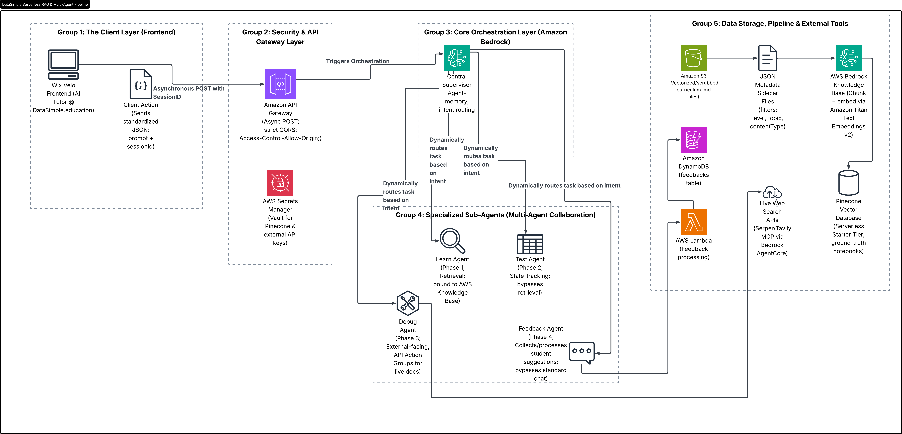

# DataSimple.education Serverless GenAI Agent & Data Pipeline
This repository contains the architecture, data preparation, and metadata strategy for the DataSimple.education RAG (Retrieval-Augmented Generation) Chatbot. Built on AWS, this system integrates a static educational knowledge base with a dynamic web-search agent and a persistent user feedback loop.

## Architecture Overview

**[Click here to read the full Project & Architecture Report (PDF)](docs/DataSimple-Chatbot-Project-Report.pdf)**

This project utilizes a decoupled, serverless AWS architecture to manage cost, latency, and data freshness. 

* **The RAG Pipeline (Persistent Knowledge):** Scrubbed curriculum files (`.md`) and their corresponding metadata sidecars are stored in **Amazon S3**. **AWS Bedrock Knowledge Base** chunks and embeds these documents using **Amazon Titan Text Embeddings v2**, storing the resulting vectors in a Serverless **Pinecone Vector Database** for semantic retrieval.
* **The Agentic Web Search (Ephemeral Context):** When user queries fall outside the static curriculum, **Bedrock AgentCore** dynamically routes requests to Live Web Search APIs (Serper/Tavily via MCP). This data is injected into the LLM's working memory to synthesize a real-time answer and is instantly discarded to optimize costs and reduce data staleness.
* **The Feedback Loop (Persistent Storage):** User ratings and interactions are routed through a dedicated **AWS Lambda (Feedback processing)** function, which cleans and writes the payload to an **Amazon DynamoDB** (`feedbacks` table) for continuous model evaluation and curriculum improvement.

##The Content Catalog
This repository manages the metadata for nearly 100 Guided Projects and Data Tips from the DataSimple curriculum, ensuring the AI can precisely filter and recommend content across:

Data Analysis & Visualization: Pandas, Seaborn, Plotly, Sweetviz.

Machine Learning: Sklearn (Regression, Classification, Clustering), Ensemble Methods (XGBoost, LightGBM), and Explainability (SHAP, Yellowbrick).

Deep Learning: TensorFlow (Sequential & Functional APIs), Recurrent Neural Networks (RNN/LSTM), and Computer Vision (CNNs).

Natural Language Processing (NLP): TensorFlow Text Generation, Hugging Face Transformers, and NLP Pipelines.

##How to Use This Repository
AWS Bedrock Knowledge Bases require a "sidecar" .metadata.json file for every single document to allow Pinecone to perform metadata filtering (e.g., filtering out Level 6 projects when a beginner asks a question). Instead of managing hundreds of individual JSON files manually, this pipeline manages a single master_metadata.json file and automates the extraction.

### Step 1: Update the Master JSON
When a new guided project or data tip is published, add a new block to master_metadata.json using the standardized tagging system:

contentType: "guided_project" or "data_tip"

difficultyLevel: 1 through 10

topic: "Data Analysis", "Data Visualization", "Machine Learning", "Deep Learning", or "Deep Learning NLP"

libraries: e.g., ["Pandas", "Seaborn"], ["TensorFlow", "Hugging Face"]

hasCode: "true" or "false"

hasVideo: "true" or "false" (Allows the LLM to know if a video exists)

videoUrl: "https://youtube.com/..." (Allows the LLM to provide the student with a direct link)

###Step 2: Generate the Sidecar Files
Run the Python automation script to unpack the master JSON into the individual files Bedrock expects.

Bash
python generate_bedrock_sidecars.py
This script will dynamically read the master catalog and create a folder called bedrock_metadata_sidecars/ containing the exact [filename].md.metadata.json format required by AWS.

### Step 3: Sync to S3
Upload your clean .md markdown files to your S3 bucket.

Upload the newly generated .metadata.json files alongside them.

Click "Sync" in your AWS Bedrock Knowledge Base Console to trigger the Amazon Titan embedding process and update the Pinecone vector database.